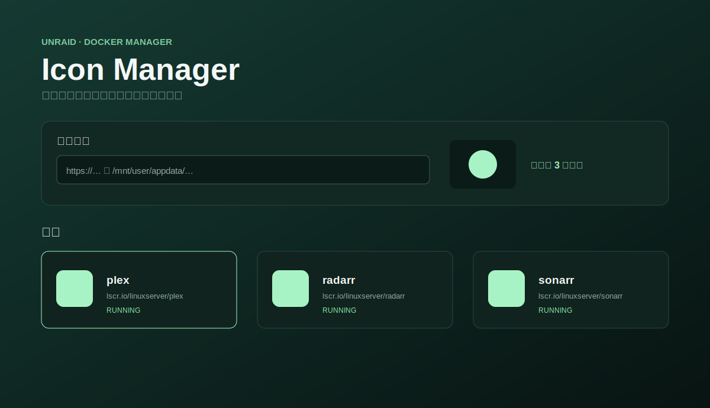

<div align="center">
  
  <h1>Unraid Icon Manager</h1>
  <p><strong>让每一个 Unraid Docker 容器都有整齐、稳定、可回滚的图标。</strong></p>
  <p>
    <a href="https://github.com/Wning-ady/unraid-icon-manager/releases/latest"></a>
    <a href="https://hub.docker.com/r/waning/unraid-icon-manager"></a>
    <a href="https://github.com/Wning-ady/unraid-icon-manager/actions/workflows/ci.yml"></a>
    <a href="LICENSE"></a>
  </p>
  <p>
    中文主文档 · <a href="README.en.md">English supplementary documentation</a> ·
    <a href="#完整-docker-compose-部署">Docker Compose 部署</a> ·
    <a href="#升级与回滚">升级与回滚</a> ·
    <a href="SECURITY.md">安全说明</a>
  </p>
  
</div>

> [!IMPORTANT]
> **这是一个纯 AI 项目。**作者本人完全不会编程，只是有点强迫症，看到 Unraid 里有些容器没有图标就很难受，于是靠 AI 一点一点把这个工具做了出来。
>
> 如果它刚好也解决了你的问题，欢迎使用、反馈和参与改进；但请理解，项目的代码、测试、文档和发布流程均由 AI 协助完成。

通过轻量级、自托管 Web 管理界面批量管理**当前已部署** Unraid Docker 容器的图标。保存图标时只更新模板、图库和缓存；点击**同步到 Unraid**后，工具会为所选容器持久化 `net.unraid.docker.icon`，并只重建这些容器，使 Docker Manager 与 Compose Manager 都使用新图标。

> [!WARNING]
> 本服务只能放在可信局域网。它对 Docker Manager 模板、图标缓存和 Compose Manager 项目目录拥有精确范围内的写权限；点击同步时会通过 Docker socket 重建所选容器。即使 socket 挂载为 `:ro`，Docker API 仍可执行高权限操作；不要把服务端口、反向代理或未认证入口暴露到公网。

## 功能

- 以当前已部署 Docker 容器为列表来源，而非历史模板文件。
- 直接显示 Unraid 当前 RAM/持久缓存或明确 `net.unraid.docker.icon` 标签中的实际图标，包括图标不在用户模板内的 Compose 容器。本地标签路径通过配置的 Unraid WebGUI 地址显示，不需要挂载 Compose 项目目录。
- 每个当前容器都可设置图标：已有匹配模板时更新模板；没有模板时，自动生成带清晰标记和审计记录的专用图标元数据模板，匹配实际容器名与镜像，并避免与现有 `my-*.xml` 文件冲突。
- 保存阶段不重建容器；用户明确点击同步后，普通容器会仅重建所选容器，Compose Manager 容器还会原子更新对应项目 `docker-compose.override.yml` 中所选服务的图标标签，再仅重建该服务。其他服务、数据卷和 Compose 主文件不受影响；失败时自动恢复原容器与 override。
- 支持搜索、多选，并可直接点击任意容器卡片打开单容器图标编辑器。
- 每次上传或实际使用外部图标 URL 时，都会先下载、校验、规范化为稳定 PNG，按内容去重后持久保存到图标图库；下载失败时不会修改模板。
- 图标图库支持复制宿主机/容器根目录；每张图标还可复制自身完整 HTTP 地址、完整宿主机文件路径和完整容器文件路径。仍被模板或变更历史引用的图标会被保护，避免破坏当前显示或回滚。
- 可从明确的 Docker Compose/容器标签及本地镜像元数据发现图标候选；选择候选后同样会先安全下载入库，不读取 Compose 文件或拉取镜像。
- 新增独立壁纸图库：支持 PNG/JPEG/WebP 上传、公网 URL 下载、下载到本地、删除、新建手动分组与移动分类。每张壁纸可复制自身完整 HTTP 地址或完整宿主机文件路径，例如 `http://UNRAID:8787/api/wallpapers/file/example.png` 和 `/mnt/user/appdata/unraid-icon-manager/wallpapers/example.png`。壁纸原始分辨率与字节会保留在 `/config/wallpapers`。
- 每次修改都会创建带时间戳的模板备份与审计记录；可单项回滚。回滚只会删除本工具创建且仍匹配的生成模板。
- 图标图库中的 PNG 会直接写入目标容器的 RAM 与持久图标缓存。两份旧缓存都会进入审计备份，可原样回滚。
- 通过 `UNRAID_DOCKER_URL` 提供**同步到 Unraid 并打开 Docker 页面**操作。
- 提供参考 Docker Copilot 信息层级的管理界面，并在“关于”页展示可选的维护者支持二维码。

程序通过 socket 读取正在运行或已部署的 Docker 容器名、镜像和状态，再寻找容器 `<Name>` 与镜像 `<Repository>` 都匹配的 Unraid 模板。历史遗留模板不会出现在列表中。运行容器标签不可原地修改，因此保存后必须点击同步；Compose Manager 项目会把新标签持久保存到 override，普通 Docker Manager 容器则继续以 Unraid 模板作为未来更新来源。

## 在 Unraid 安装

### Docker Hub 镜像

```bash
docker pull waning/unraid-icon-manager:latest
```

在 Unraid **Docker** 标签页中新建容器，并配置以下映射：

| Unraid 主机路径 | 容器路径 | 权限 | 用途 |
| --- | --- | --- | --- |
| `/mnt/user/appdata/unraid-icon-manager` | `/config` | 读写 | 数据库、图标与壁纸图库、审计记录与备份 |
| `/boot/config/plugins/dockerMan/templates-user` | `/unraid/templates-user` | 读写 | 现有与本工具生成的 Docker Manager 图标元数据 |
| `/var/lib/docker/unraid/images` | `/unraid/icon-cache` | 读写 | 只备份和更新发生变更的持久 Docker Manager 图标文件 |
| `/usr/local/emhttp/state/plugins/dynamix.docker.manager/images` | `/unraid/icon-cache-ram` | 读写 | 只备份和更新发生变更的 RAM 图标文件 |
| `/mnt/user/docker` | `/unraid/compose-projects` | 读写 | 仅原子更新所选 Compose Manager 服务的 `docker-compose.override.yml` 图标标签 |
| `/var/run/docker.sock` | `/var/run/docker.sock` | 只读挂载 | 读取容器信息；显式同步时只重建所选容器。`:ro` 不限制 Docker API 权限 |

将 TCP `8787` 映射到空闲主机端口。然后在高级变量中填写**实际主机侧 URL**：

| 变量 | 示例 | 用途 |
| --- | --- | --- |
| `PUBLIC_BASE_URL` | `http://192.168.1.10:8787` | Unraid 主机通过该 HTTP(S) URL 下载上传的 PNG 图标；必须使用映射后的主机端口，并能被 Unraid 主机访问。 |
| `UNRAID_DOCKER_URL` | `http://192.168.1.10:5000/Docker` | 点击**刷新 Docker 页面**时打开的地址；如果 WebGUI 使用其他端口，请一并修改。 |
| `ICON_HOST_ROOT` | `/mnt/user/appdata/unraid-icon-manager/icons` | 对应 `/config/icons` 的主机路径；移动 appdata 时一同修改。 |
| `COMPOSE_HOST_ROOT` | `/mnt/user/docker` | Compose Manager 的 `PROJECTS_FOLDER`；用于写回所选服务的 override。 |

启动后访问 `http://你的_UNRAID_IP:8787`。也可将 [`unraid/template.xml`](unraid/template.xml) 复制到 `/boot/config/plugins/dockerMan/templates-user/`，在 **Add Container** 中选择 **unraid-icon-manager**，并在应用前填写两个 URL 变量。

### 完整 Docker Compose 部署

下面是可以直接复制使用的**完整配置**，与仓库中的 [`docker-compose.yml`](docker-compose.yml) 保持一致。它完全不依赖 `.env`。保存为 `docker-compose.yml` 后，只需把两处 `192.168.1.10` 改成你的 Unraid IP：

```yaml
services:
  unraid-icon-manager:
    image: waning/unraid-icon-manager:latest
    container_name: unraid-icon-manager

    ports:
      - "8787:8787"

    environment:
      - TZ=Asia/Shanghai
      - ICON_HOST_ROOT=/mnt/user/appdata/unraid-icon-manager/icons
      - WALLPAPER_HOST_ROOT=/mnt/user/appdata/unraid-icon-manager/wallpapers
      - ICON_CACHE_DIR=/unraid/icon-cache
      - ICON_CACHE_RAM_DIR=/unraid/icon-cache-ram
      - COMPOSE_PROJECTS_DIR=/unraid/compose-projects
      - COMPOSE_HOST_ROOT=/mnt/user/docker
      - MAX_UPLOAD_BYTES=5242880
      - MAX_WALLPAPER_BYTES=31457280
      # 部署前把 192.168.1.10 改成你的 Unraid IP；不能填写 localhost。
      - PUBLIC_BASE_URL=http://192.168.1.10:8787
      # 如果 Unraid WebGUI 不是 5000 端口，请直接修改这里。
      - UNRAID_DOCKER_URL=http://192.168.1.10:5000/Docker

    volumes:
      # 数据库、图库、审计记录和备份。
      - /mnt/user/appdata/unraid-icon-manager:/config
      # Unraid Docker Manager 用户模板。
      - /boot/config/plugins/dockerMan/templates-user:/unraid/templates-user
      # Unraid 持久图标缓存与内存图标缓存。
      - /var/lib/docker/unraid/images:/unraid/icon-cache
      - /usr/local/emhttp/state/plugins/dynamix.docker.manager/images:/unraid/icon-cache-ram
      # Compose Manager 项目：只用于持久更新所选服务的图标标签。
      - /mnt/user/docker:/unraid/compose-projects
      # 读取容器信息；显式同步时会通过 Docker API 重建所选容器。
      - /var/run/docker.sock:/var/run/docker.sock:ro

    security_opt:
      - no-new-privileges:true

    restart: unless-stopped
```

所有参数都直接写在 Compose 中，不需要创建其他文件。确认 IP、端口和路径后，先检查配置，再启动：

```bash
docker compose config
docker compose pull
docker compose up -d
```

启动完成后访问 `http://你的_UNRAID_IP:8787`。建议同时检查健康状态：

```bash
curl http://你的_UNRAID_IP:8787/api/health
```

正常结果中，`ok`、`templatesWritable` 和 `iconCachesMounted` 都应为 `true`。

#### Compose 服务字段逐项说明

| 字段 | 当前设置 | 含义与注意事项 |
| --- | --- | --- |
| `services.unraid-icon-manager` | 服务名 | Compose 内部服务标识；升级命令可以只操作它，避免影响同一项目里的其他服务。 |
| `image` | `waning/unraid-icon-manager:latest` | 要运行的镜像。`latest` 跟随最新版；希望升级可控时，直接改为 `waning/unraid-icon-manager:v0.1.16`。 |
| `container_name` | `unraid-icon-manager` | 固定容器名，便于在 Unraid 和命令行中查找。若已有同名容器会冲突；本工具不应运行多个副本。 |
| `ports` | `8787:8787` | 左侧是 Unraid 主机端口，右侧是容器内固定端口。只改左侧即可换访问端口，同时必须修改 `PUBLIC_BASE_URL`。默认监听主机全部网络接口，所以只能在可信局域网使用。 |
| `environment` | 见下表 | 时区、上传限制、图标地址和 Unraid 页面地址全部直接写在 YAML 中；修改后重新创建本工具容器即可生效。 |
| `volumes` | 六项挂载 | 让数据库、模板、两级图标缓存和 Compose Manager 图标标签持久化，并通过 Docker socket 同步所选容器。每一项的具体权限见下表。 |
| `security_opt` | `no-new-privileges:true` | 禁止容器进程通过 setuid/setgid 等方式获得额外权限；这是额外保护，但不能消除 Docker socket 本身的高权限风险。 |
| `restart` | `unless-stopped` | Unraid 或 Docker 重启后自动恢复；如果你手动停止容器，它不会自己再次启动。 |

#### Compose 环境参数逐项说明

| 参数 | 默认/示例 | 是否必填 | 作用 |
| --- | --- | --- | --- |
| `TZ` | `Asia/Shanghai` | 否 | 容器时区，影响界面与日志中的本地时间显示。 |
| `ICON_HOST_ROOT` | `/mnt/user/appdata/unraid-icon-manager/icons` | 是 | `/config/icons` 在 Unraid 主机上的对应路径。修改 `/config` 的主机挂载时，必须同步修改。 |
| `WALLPAPER_HOST_ROOT` | `/mnt/user/appdata/unraid-icon-manager/wallpapers` | 是 | `/config/wallpapers` 在 Unraid 主机上的对应路径，用于复制正确的宿主机路径。 |
| `COMPOSE_HOST_ROOT` | `/mnt/user/docker` | Compose Manager 用户是 | Compose Manager 插件设置中的 `PROJECTS_FOLDER`。不是该目录时必须修改，否则 Compose 图标不能持久化。 |
| `MAX_UPLOAD_BYTES` | `5242880` | 否 | 单个上传文件的最大字节数，默认 `5 MiB`。过大的 PNG、SVG 或 WebP 会被拒绝。 |
| `MAX_WALLPAPER_BYTES` | `31457280` | 否 | 单张上传或 URL 下载壁纸的最大字节数，默认 `30 MiB`。 |
| `PUBLIC_BASE_URL` | `http://192.168.1.10:8787` | **是** | 写入 Unraid 模板的图标服务根地址，必须从 Unraid 主机自身可访问。不能填容器内部地址或 `localhost`；端口必须与 `ports` 左侧的主机端口一致。 |
| `UNRAID_DOCKER_URL` | `http://192.168.1.10:5000/Docker` | **是** | 点击**刷新 Docker 页面**时打开的地址。若 Unraid WebGUI 使用自定义端口，必须把端口写完整。 |

Compose 内还有三个固定的容器内环境变量：`ICON_CACHE_DIR=/unraid/icon-cache`、`ICON_CACHE_RAM_DIR=/unraid/icon-cache-ram` 和 `COMPOSE_PROJECTS_DIR=/unraid/compose-projects`。它们必须与对应挂载的**容器路径**一致，一般不要修改。

#### 六个挂载逐项说明

| 主机路径 → 容器路径 | 权限 | 是否必需 | 具体作用 |
| --- | --- | --- | --- |
| `/mnt/user/appdata/unraid-icon-manager` → `/config` | 读写 | 是 | 保存数据库及其 WAL 文件、图标/壁纸图库、XML/缓存备份和审计记录；不挂载会导致重建容器后数据丢失。 |
| `/boot/config/plugins/dockerMan/templates-user` → `/unraid/templates-user` | 读写 | 是 | 原子更新已有 Unraid Docker 模板的 `<Icon>`，或为没有模板的当前容器创建专用图标元数据模板。 |
| `/var/lib/docker/unraid/images` → `/unraid/icon-cache` | 读写 | 是 | 备份和更新 Unraid Docker Manager 的持久图标缓存，只处理被修改的目标容器。 |
| `/usr/local/emhttp/state/plugins/dynamix.docker.manager/images` → `/unraid/icon-cache-ram` | 读写 | 是 | 备份和更新运行时 RAM 图标缓存，让刷新 Docker 页面后立即看到新图标。 |
| `/mnt/user/docker` → `/unraid/compose-projects` | 读写 | Compose Manager 用户是 | 原子备份并更新所选项目 `docker-compose.override.yml` 中所选服务的图标标签；如果插件的 `PROJECTS_FOLDER` 不同，需要同时修改挂载和 `COMPOSE_HOST_ROOT`。 |
| `/var/run/docker.sock` → `/var/run/docker.sock` | **只读挂载** | 是 | 读取容器信息；只有用户点击同步时才停止、删除并以相同配置重建所选容器。Docker socket 即使标为 `:ro` 仍允许高权限 API 操作。 |

> [!CAUTION]
> 部署前必须直接修改 `PUBLIC_BASE_URL` 和 `UNRAID_DOCKER_URL` 中的示例 IP。不要填写 `localhost`、容器名或仅容器网络可见的地址，也不要把 Docker socket、模板和缓存写权限暴露给公网服务。

## 使用与恢复

1. 选择一个或多个当前容器，或点击单个可编辑容器。
2. 粘贴 HTTP(S) 图标 URL、图库地址，或上传图片。
3. 应用图标；外部 URL 会先下载到图库并规范化，没有匹配模板时再创建带标记的图标元数据模板。
4. 保存后点击**同步到 Unraid**。工具会更新缓存，并只重建所选容器；Compose Manager 服务会先写回对应 override。同步成功后打开 Docker 页面即可看到新图标。

壁纸图库不会修改 Unraid Docker 页面，只作为持久化素材库使用。顶部可新建分组，上传或 URL 下载时会放入当前分组；每张壁纸可随时改分类、下载、删除，或复制该图片自身的完整 HTTP 地址与完整宿主机文件路径。

每次更新都会把原始 XML 备份到 `/config/backups/`，并以紧凑的修改前/修改后历史快照记录在**最近变更**；展开记录可查看完整图标地址。只有最新且仍与当前模板一致的修改会显示**回滚**，回滚会同时恢复模板与两级 Unraid 图标缓存。若该审计记录创建了模板，只有在模板仍未被外部修改时才会删除该生成模板。回滚后还需点击同步，才能恢复运行容器不可变的图标标签。

## 升级与回滚

- 升级前备份 `/mnt/user/appdata/unraid-icon-manager`；其中包含 SQLite 数据库、图标图库、审计记录与备份。
- Compose 安装如需固定版本，直接把 `image` 改为目标完整标签（例如 `waning/unraid-icon-manager:v0.1.16`），然后只更新本工具：

```bash
docker compose pull unraid-icon-manager
docker compose up -d --no-deps unraid-icon-manager
```

- 不要为了升级本工具执行会影响其他服务的 `docker compose down`。Unraid 图形界面安装时，也只更新 `unraid-icon-manager` 的镜像标签。
- 升级后检查 `http://你的地址/api/health` 中 `templatesWritable` 与 `iconCachesMounted` 是否都是 `true`，并通过 `/api/about` 核对版本。
- 从**最近变更**回滚单项图标并再次点击同步。如需回退本工具版本，选择旧镜像标签，同时保留 `/config` 和全部六项挂载。

## 本地开发与测试

```bash
npm ci
npm run dev
npm run check
```

本地开发变量以 [`src/server/config.ts`](src/server/config.ts) 的默认值为准；Compose 部署参数全部直接写在 [`docker-compose.yml`](docker-compose.yml) 中。生产镜像支持 `linux/amd64` 与 `linux/arm64`。

## 发布

推送例如 `v0.1.16` 的标签后，GitHub Actions 会发布以下 Docker Hub 标签：

- `waning/unraid-icon-manager:latest`
- `waning/unraid-icon-manager:v0.1.16`
- `waning/unraid-icon-manager:v0.1`

仓库维护者需要配置 `DOCKERHUB_USERNAME=waning` 与 `DOCKERHUB_TOKEN` 两个 GitHub Actions Secret。凭据不会保存在仓库中。

## 安全

请阅读 [SECURITY.md](SECURITY.md)。外部图片导入只接受经校验的公网 HTTP(S) 地址与栅格图片，阻止本机/私网/保留地址并限制 DNS、连接、总时长、重定向和字节数；考虑到公开图标站常使用自定义端口，公网自定义端口仍受支持。Docker socket、模板、两个缓存与 Compose Manager 项目挂载都属于特权主机访问。只挂载插件实际配置的 `PROJECTS_FOLDER`，不要扩大到整个 `/mnt/user`、`/boot` 或 `/var/lib/docker`。请私下报告漏洞，且不要上传包含私有 URL、路径、挂载或密钥的诊断信息。

## 许可证

[MIT](LICENSE)
